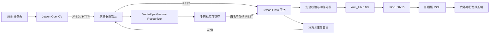

# DOFBOT 真机手势控制系统技术报告

> 最终版本：2026-09-28  
> 交付形态：Jetson Nano 真机 Web 控制系统  
> 项目状态：功能冻结，可用于现场验收  
> 操作手册：[`commands.md`](../commands.md)

## 1. 项目摘要

本项目在 Yahboom DOFBOT 与 Jetson Nano 上实现了一套局域网真机控制系统。系统通过 USB 摄像头
采集实时视频，在浏览器端使用 MediaPipe 识别手部骨架和四种手势，并通过 Jetson 上的轻量 Web
服务控制六路串行总线舵机。

最终交付功能包括：

- Jetson 摄像头实时画面；
- 21 点手部骨架叠加；
- 点赞、握拳、V 手势和食指向上四手势识别；
- 手势触发夹爪、等候姿势和点头动作；
- 六路舵机滑条与 ±1°控制；
- K1 直立复位后的网页状态同步；
- 一键返回等候姿势；
- 急停与恢复扭矩；
- 六路舵机命令状态表；
- 机械臂事件终端；
- 摄像头设备节点自动探测；
- 服务端角度、步长、时长、动作窗口和单进程保护。

本报告只描述最终真机系统及其现场验收流程。

## 2. 最终交付边界

### 2.1 已完成并纳入验收

| 功能 | 完成状态 | 验收方式 |
|---|---|---|
| 真机网页 | 已完成 | 局域网浏览器打开 8765 端口 |
| USB 摄像头 | 已完成 | 页面连续出图并显示实际设备节点 |
| 手部骨架 | 已完成 | 画面叠加 21 个关键点与连线 |
| 四手势识别 | 已完成 | 页面显示类别、置信度和稳定进度 |
| 夹爪开合 | 已完成 | 点赞张开、握拳闭合 |
| 等候姿势 | 已完成 | 按钮或食指手势触发 |
| V 手势动作 | 已完成 | 回等候姿势后点头两次 |
| 六轴手动控制 | 已完成 | 每次只允许有限角度变化 |
| K1 状态同步 | 已完成 | 人工确认后只同步软件基准 |
| 急停与恢复扭矩 | 已完成 | 网页按钮与事件日志 |
| 六轴状态表 | 已完成 | 展示目标、命令状态、时间和说明 |
| 事件终端 | 已完成 | 展示最近 80 条事件 |

## 3. 硬件与系统环境

### 3.1 核心硬件

| 组件 | 当前配置 |
|---|---|
| 机械臂 | Yahboom DOFBOT，六路串行总线舵机 |
| 主控 | NVIDIA Jetson Nano Developer Kit |
| 扩展板 | Yahboom DOFBOT 扩展板 |
| 摄像头 | Sonix/Microdia USB 2.0 Camera |
| 摄像头 USB ID | `0c45:6340` |
| 网络 | Jetson 与验收电脑位于同一局域网 |
| 当前 Jetson 地址 | `192.168.1.149`，换网络后可能变化 |

### 3.2 Jetson 软件环境

| 项目 | 实测值 |
|---|---|
| Ubuntu | 18.04.6 LTS |
| L4T | R32.4.4 |
| 内核 | `4.9.140-tegra` |
| 架构 | AArch64 |
| Python | 3.6.9 |
| CUDA | 10.2 |
| ROS | ROS 1 Melodic |
| OpenCV | 可用，负责 V4L2 读取和 JPEG 编码 |
| Arm_Lib | 0.0.5 |
| Web 框架 | Flask |
| 根文件系统 | USB `/dev/sda1` |
| 真机服务目录 | `/home/jetson/dofbot-web` |

### 3.3 控制链路

`Arm_Lib` 使用 Jetson 的 I²C-1 与扩展板 MCU 通信，控制板地址为 `0x15`。扩展板 MCU 再向串行
总线舵机发送 ID、角度和动作时间。浏览器不会直接接触 I²C，也不会直接加载 `Arm_Lib`。

## 4. 系统总体架构



架构将识别与硬件控制分开：浏览器承担手势推理和交互，Jetson 服务作为唯一硬件命令裁决者。
即使前端出现错误，服务端仍会重新校验舵机 ID、目标范围、单步跨度、动作时间、扭矩状态和动作窗口。

## 5. 文件结构

最终运行相关文件如下：

```text
dofbot-vlm/
├── commands.md
├── docs/
│   ├── TECHNICAL_REPORT.md
│   ├── CALIBRATION.md
│   └── HARDWARE_SETUP.md
├── jetson_app/
│   ├── server.py
│   ├── hardware_config.json
│   └── README.md
├── frontend/
│   ├── hardware-control.html
│   ├── hardware-control.css
│   ├── hardware-control.js
│   └── vendor/mediapipe/
│       ├── gesture_recognizer.task
│       ├── vision_bundle.mjs
│       └── wasm/
└── tests/
    └── test_jetson_server_safety.py
```

Jetson 上的对应部署结构：

```text
/home/jetson/dofbot-web/
├── server.py
├── hardware_config.json
├── server.log
├── backups/
└── web/
    ├── hardware-control.html
    ├── hardware-control.css
    ├── hardware-control.js
    └── vendor/mediapipe/
```

## 6. 后端设计

### 6.1 摄像头管理

服务配置候选节点 `[0, 1, 2, 3]`。启动时依次打开 `/dev/video0..3`，只有实际读取到图像的节点才会
被选中。连续 8 次取帧失败后会释放设备并重新扫描。

摄像头配置：

```text
分辨率：640 × 480
JPEG 质量：82
服务端最大帧率：12 FPS
当前实测节点：/dev/video1
```

图像接口返回 `X-DOFBOT-Camera-Device` 响应头，前端据此显示实际节点。这样即使 Linux 枚举顺序
变化，也不要求摄像头永久固定为 `/dev/video0`。

### 6.2 硬件所有权

真机模式启动时，服务尝试独占锁定：

```text
/tmp/dofbot_web_hardware.lock
```

锁已被其他网页控制器占用时，新进程直接失败，防止两个服务同时写机械臂。

### 6.3 启动确认

真机控制必须同时满足：

1. 命令行带 `--enable-hardware`；
2. 环境变量为 `DOFBOT_HARDWARE_CONFIRM=POWER_CUTOFF_READY`；
3. `hardware_config.json` 中手动控制已启用；
4. 成功获得硬件独占锁。

任一条件不满足时，不进入真机控制模式。

### 6.4 舵机命令校验

每条单轴命令都执行以下校验：

- ID 必须是 1–6；
- 舵机必须在配置中启用；
- 目标必须位于配置逻辑范围；
- 动作时间必须是 1500–5000 ms；
- 目标相对软件当前目标最多变化 10°；
- 急停状态下拒绝运动；
- 上一条动作时间窗口结束前拒绝所有新命令。

通过校验后才调用：

```python
Arm_serial_servo_write(servo_id, angle, duration_ms)
```

### 6.5 复合动作

夹爪与等候姿势可能跨越多个 10°区间。后端不会一次发送最终大跨度目标，而是按 10°拆分，并在
每个动作时间结束后发送下一条。

等候姿势固定按 S1、S2、S3、S4、S5、S6 顺序执行，不同时发送六轴全幅运动。

### 6.6 急停与恢复

急停调用厂家总线扭矩关闭接口；恢复调用扭矩开启接口。急停的语义是“释放保持力”，不是机械制动，
因此机械臂可能下坠。页面在执行前要求操作者确认已经托住机械臂。

## 7. 前端设计

页面使用原生 HTML、CSS 和 JavaScript，不依赖 Jetson 上的 Node.js 构建工具。主要区域包括：

1. 摄像头画面；
2. Canvas 手部骨架覆盖层；
3. 手势类别、置信度和稳定进度；
4. 现场安全确认框；
5. 六轴滑条与 ±1°按钮；
6. K1 同步与等候姿势按钮；
7. 急停与恢复扭矩；
8. 六舵机状态表；
9. 最近 80 条事件终端。

页面每秒请求一次遥测。滑条输入经过 140 ms 合并，浏览器同时只保留一个待发送目标；服务返回命令
后，页面在动作时长结束前不再发送下一条。

## 8. 手势识别

### 8.1 模型

- MediaPipe Tasks Vision：1.0.1。
- 模型：`gesture_recognizer.task` float16。
- 模型、JavaScript 模块和 WASM 均存放在 Jetson 本地。
- 推理发生在浏览器，不依赖外网。
- 单次最多识别一只手。
- 置信度阈值：0.72。

### 8.2 骨架

前端从 MediaPipe 获得 21 个手部关键点，在 640×480 Canvas 上绘制点和标准手部连接关系。摄像头
可镜像预览，骨架坐标与显示画面保持一致。

### 8.3 稳定与锁存

普通识别结果不会立即控制机械臂。相同类别必须连续出现指定帧数：

- 点赞、握拳：6 帧；
- V 手势、食指向上：7 帧。

达到阈值后动作锁存。手势消失后才解除锁存，防止用户一直保持一个姿势导致连续重复触发。

### 8.4 最终手势映射

| 手势 | MediaPipe 类别 | 动作 |
|---|---|---|
| 👍 点赞 | `Thumb_Up` | 夹爪张开到 120° |
| ✊ 握拳 | `Closed_Fist` | 夹爪闭合到 180° |
| ☝️ 食指向上 | `Pointing_Up` | 回到等候姿势 |
| ✌️ V 手势 | `Victory` | 回等候姿势后点头两次 |

V 手势点头序列由 S4 执行：

```text
50 → 40 → 30 → 40 → 50 → 40 → 30 → 40°
```

每一步时间为 1500 ms。

## 9. 舵机与姿势配置

### 9.1 六轴配置

| ID | 名称 | 页面逻辑范围 | 服务初始目标 | 最大单步 |
|---:|---|---:|---:|---:|
| 1 | 底座 | 0–180° | 90° | 10° |
| 2 | 肩部 | 0–180° | 130° | 10° |
| 3 | 肘部 | 0–180° | 0° | 10° |
| 4 | 腕部俯仰 | 0–180° | 40° | 10° |
| 5 | 腕部旋转 | 0–270° | 90° | 10° |
| 6 | 夹爪 | 0–180° | 120° | 10° |

这些范围来自厂家 API 逻辑定义，不等于已经测量的完整机械安全范围。最终验收仅使用已验证动作和
小幅 ±1°单轴演示。

### 9.2 夹爪

现场确认：

```text
张开：120°
闭合：180°
每个子步：不超过 10°，1500 ms
```

120°到 180°共 6 个子步，理论动作时间约 9 秒。

### 9.3 K1 直立基准

扩展板 K1 由底层 MCU 直接控制舵机，Jetson 无法自动收到按键事件。原厂初始直立控制使用：

```text
90 / 90 / 90 / 90 / 90 / 90°
```

页面提供“已按 K1：同步直立姿势”。该按钮只把软件目标更新为六轴 90°，不调用 Arm_Lib，不发送
舵机命令。操作者只有在实际按过 K1 且机械臂已经稳定直立时才能确认。

### 9.4 等候姿势

最终等候姿势：

```text
S1 / S2 / S3 / S4 / S5 / S6
90 / 130 / 0 / 40 / 90 / 180°
```

该姿势由操作者通过网页逐轴调整并现场确认能够稳定保持。K1 直立基准到等候姿势需要约 27 个
10°子步，理论总时长约 40.5 秒。

## 10. 状态与事件系统

### 10.1 舵机状态表

每个舵机显示：

- ID；
- 关节名称；
- 最后目标；
- 实测角度；
- 命令状态；
- 最后命令时间；
- 说明。

当前没有启用可靠的持续角度反馈，因此“实测”保持为未知。系统不会把最后目标伪装成已经到位。

### 10.2 事件日志

服务内存最多保存 200 条，页面显示最近 80 条。事件类型包括：

- 服务启动；
- 舵机命令接受；
- 越界、超步长或动作窗口拒绝；
- 手势触发与拒绝；
- 等候姿势开始与完成；
- 扭矩关闭与恢复；
- K1 软件基准同步。

事件日志在服务重启后清空，`server.log` 保留 HTTP 与进程输出。

## 11. HTTP API

| 方法 | 路径 | 功能 | 是否可能运动 |
|---|---|---|---|
| GET | `/` | 真机控制台 | 否 |
| GET | `/web/<name>` | 页面静态资源 | 否 |
| GET | `/api/status` | 完整状态与配置 | 否 |
| GET | `/api/telemetry` | 目标、舵机状态与事件 | 否 |
| GET | `/api/camera/frame.jpg` | 当前 JPEG 帧 | 否 |
| POST | `/api/servos/{id}` | 单轴目标 | 是 |
| POST | `/api/gripper/open` | 张开夹爪 | 是 |
| POST | `/api/gripper/close` | 闭合夹爪 | 是 |
| POST | `/api/standby` | 进入等候姿势 | 是 |
| POST | `/api/gestures/{name}` | 执行白名单手势动作 | 是 |
| POST | `/api/emergency-stop` | 关闭舵机扭矩 | 可能下坠 |
| POST | `/api/resume` | 恢复舵机扭矩 | 可能产生保持动作 |
| POST | `/api/sync-k1` | 同步 K1 软件基准 | 否 |

运动 API 不用于命令行验收，统一由网页安全确认后调用。

## 12. 关键故障与修复

### 12.1 查询函数行为异常

早期测试发现，`Arm_serial_servo_read()` 和 `Arm_ping_servo()` 在当前控制板路径上不能作为完全无副作用
的读取：出现过返回不稳定、舵机进入保持扭矩状态和一次意外运动。

最终方案不持续读取舵机寄存器。页面只显示命令目标，并明确把实际反馈标记为未知。旧硬件识别和标定
脚本的执行路径保持禁用，不进入验收流程。

### 12.2 夹爪 ID 6 无响应

夹爪曾出现 `ping(6)` 无响应，但直接控制可以工作。K1 也能正常驱动夹爪，最终验证 120°张开、
180°闭合。因此最终系统不使用 ping 结果判断舵机是否存在。

### 12.3 控制线断裂与下落

调试中曾发生机械臂下落，日志未记录急停、服务崩溃或 I²C 错误，现场随后确认控制线断开。最终系统
增加状态表、事件终端、单轴限步和动作窗口，但软件无法补偿物理线束断裂。验收前必须检查并固定线束。

### 12.4 K1 后一度命令产生大幅运动

K1 在底层改变了真实姿态，网页仍保存旧目标。网页认为只变化 1°，实际真机可能离目标很远。
最终增加显式 K1 同步，按 K1 后先把软件基准设为六轴 90°，再执行任何动作。

### 12.5 K1 后返回等候姿势无反应

网页缓存曾正好等于等候目标，代码判断无需运动，导致按钮和手势同一秒开始并完成却没有舵机命令。
K1 同步按钮解决了真实姿态与软件缓存分离的问题。

### 12.6 摄像头设备节点变化

摄像头曾从 `/dev/video0` 变为 `/dev/video1`，固定节点造成页面黑屏。最终使用实际取帧探测和失败后
重新扫描，页面显示服务选择的真实节点。

## 13. 测试与验证

最终版本已经完成以下检查：

- Python 后端语法编译通过；
- 前端 JavaScript `node --check` 通过；
- Git 空白错误检查通过；
- 配置结构和姿势目标检查通过；
- 假硬件验证所有舵机单条命令不超过 10°；
- 假硬件验证夹爪分段开合；
- 假硬件验证四个手势映射；
- 假硬件验证 K1 同步产生 0 次 Arm_Lib 调用；
- 摄像头候选节点自动探测测试通过；
- Jetson 端 Python 编译通过；
- Jetson 状态接口返回 HTTP 200；
- 摄像头 JPEG 连续返回 HTTP 200；
- 不同时刻图像哈希不同，确认不是旧帧；
- 页面已现场验证夹爪、六轴滑条和摄像头手势骨架。

开发机当前默认 Python 环境没有安装 pytest，因此最终修改后没有重新执行整套 pytest。相关安全测试
源文件已经保留在 `tests/test_jetson_server_safety.py`。

## 14. 部署与运行

Jetson 最终启动命令：

```bash
cd /home/jetson/dofbot-web
export DOFBOT_HARDWARE_CONFIRM=POWER_CUTOFF_READY
nohup python3 /home/jetson/dofbot-web/server.py \
  --host 0.0.0.0 \
  --port 8765 \
  --web-root /home/jetson/dofbot-web/web \
  --enable-hardware \
  > /home/jetson/dofbot-web/server.log 2>&1 < /dev/null &
```

验收浏览器地址：

```text
http://192.168.1.149:8765/
```

完整启动、验收、故障检查、重启、重新部署和关机命令见 [`commands.md`](../commands.md)。

## 15. 最终验收流程

1. 检查接线、底座、工作区和物理断电手段。
2. 启动 Jetson 和机械臂主控。
3. SSH 检查并启动唯一网页服务。
4. 打开网页，确认硬件模式、摄像头和模型就绪。
5. 按 K1，等待直立稳定。
6. 勾选现场安全确认并执行 K1 软件同步。
7. 返回等候姿势。
8. 验证摄像头、骨架和四手势。
9. 六轴各执行一次 +1°和 -1°。
10. 展示状态表和事件终端。
11. 根据现场安全条件决定是否实际演示急停卸扭矩。
12. 验收结束后正常关闭 Jetson，再断开舵机电源。

## 16. 最终限制与使用条件

### 16.1 已知限制

1. 页面没有真实舵机到位反馈。
2. K1 同步依赖操作者正确确认。
3. 页面全范围是厂家逻辑范围，不是逐轴测量的完整机械安全范围。
4. 复合动作被底层动作窗口保护，但没有完整的动作队列事务和取消令牌。
5. 急停通过卸载扭矩实现，机械臂可能下坠。
6. Web 服务没有用户认证和 HTTPS。
7. 事件日志主要保存在内存，服务重启会清空。
8. 服务当前使用 `nohup`，没有配置专用 systemd 单元。
9. 软件无法检测或修复舵机线束断裂。

### 16.2 使用条件

- 仅在可信局域网内运行；
- 只使用页面已经定义的动作；
- 每次按 K1 后执行网页 K1 同步；
- 动作期间不重复发送命令；
- 急停前必须托住机械臂；
- 不带电插拔线束；
- 不运行旧的 ID、读取、偏移或极限标定命令；
- 不同时运行原厂 Notebook、App、手柄动作组和本网页控制器。

## 17. 结论

最终系统已经完成“摄像头—浏览器手势识别—安全 REST 控制—扩展板—六路舵机”的真机闭环。
它能够在局域网网页中实时显示摄像头和手部骨架，通过四种手势执行夹爪、回位和点头动作，并提供
六轴手动控制、K1 同步、急停恢复、状态表和事件日志。

项目最终定位为一套可现场演示、操作路径明确、对硬件异常保持诚实的 DOFBOT 真机手势控制系统。
系统不会把目标角度伪装成实测反馈，也不会在 K1 改变真实姿态后继续沿用旧软件基准。按照
`commands.md` 的固定流程，可以从上电、启动服务一直完成验收和安全关机。

## 参考资料

- [Yahboom DOFBOT Jetson Nano 官方仓库](https://github.com/YahboomTechnology/dofbot-jetson_nano)
- [Yahboom 扩展板 K1/K2 说明](https://www.yahboom.com/build.html?id=4528)
- [Yahboom 单舵机控制教程](https://www.yahboom.net/public/upload/upload-html/1777291103/Control%20Single%20Servo.html)
- [MediaPipe Tasks Vision](https://www.npmjs.com/package/@mediapipe/tasks-vision)
